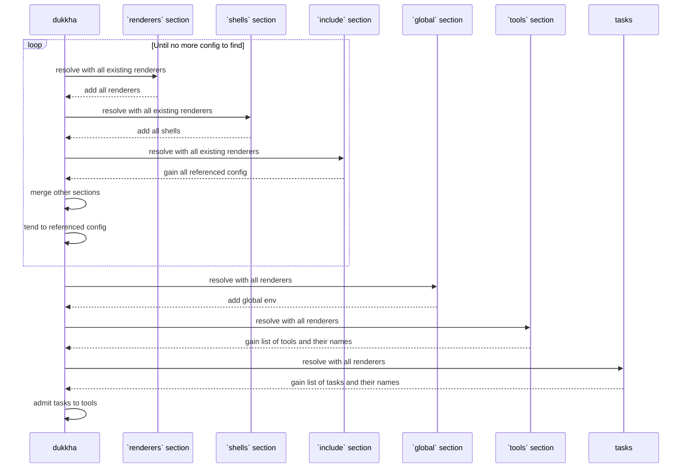
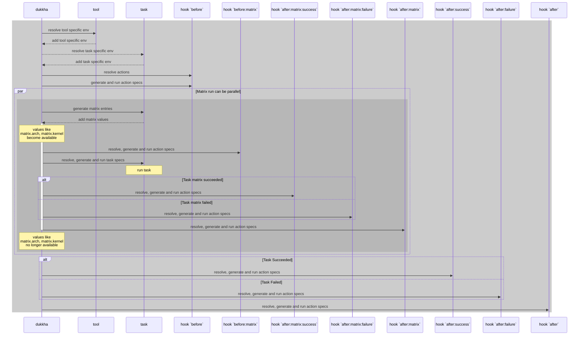

# Docs

## Index

- [Learning Path](#learning-path)
- [Constants](./constants.md)
- [Environment Variables](./env.md)
- [Tools](./tools.md)
- [Tasks](./tasks.md)
- [Shells](./shells.md)

## Learning Path

1. [Major dukkha config sections](#configuration-overview)
2. [Renderers' general concepts and config](./renderers.md)
3. Renderer specific usage (e.g. [`tpl`](./renderers/tpl.md))
4. [Tools' concepts and general config](./tools.md)
5. [Tasks' concepts and general config](./tasks.md)
6. [Shells](./shells.md)
7. Task specific usage (e.g. [`workflow:run`](./tools/workflow.md#task-workflow-run))
8. [How config is loaded](#config-resolving-process)
9. [dukkha commands](#command-overview)
10. Be aware of [Filesystem](./filesystem.md) difference

## Configuration Overview

```yaml
# renderer groups for renderer's config definition
renderers: []

# include other dukkha config from file/dir/text
include: []

# global config
global: {}

# declare tools used in this project
tools: []

# declare external shells used in this project
shells: []

# other top level fields are pattern matched as tasks
# e.g.
#   # workflow run tasks
#   workflow:run: []
```

## Config Resolving Process

### Loading

Before loading config, dukkha prepares serval essential renderers for bootstrapping, these renderers are

- `echo`
- `env` without arbitrary command execution support
- `shell`
- `tpl`
- `http`
- `file`
- `T`

To load config, there must be an entrypoint file/dir for dukkha, the entrypoint(s) can be specified by cli flag `--config` (or `-c`), `.dukkha.yaml` in the current working directory will be used when no `--config` flag is provided.

1) dukkha reads the config file, unmarshal it as yaml doc, resolve `renderers` section in the config, add all renderers defined in this section, if there are renderers with same name, last appeared will be effective.

2) Combined with essential renderers, dukkha resolves `include` section to find references to other config, but instead of reading referenced config immediately, dukkha merges all exisitng config first (excluding `include` and `renderers`).

3) Go over same process as 1) for referenced config files/texts

4) After all config been loaded into memory, resolve tools and tasks



### Run



## Command Overview

### `run` task

- `run <tool-kind> <tool-name> <task-kind> <task-name>`

### `debug` config

- `debug`
  - `task`
    - `spec [tool-kind] [tool-name] [task-kind] [task-name]`
    - `matrix [tool-kind] [tool-name] [task-kind] [task-name]`
    - `list [tool-kind] [tool-name] [task-kind] [task-name]`

### `render` arbitrary yaml files (using rendering suffix)

- `render [... files/dirs to render]`

### `diff` yaml files with reasoning

- `diff [file-source] <file-original> <file-updated>`

__NOTICE:__ This command is still a work in progress to showcase potential rendering suffix usage, and doesn't produce useful output.
